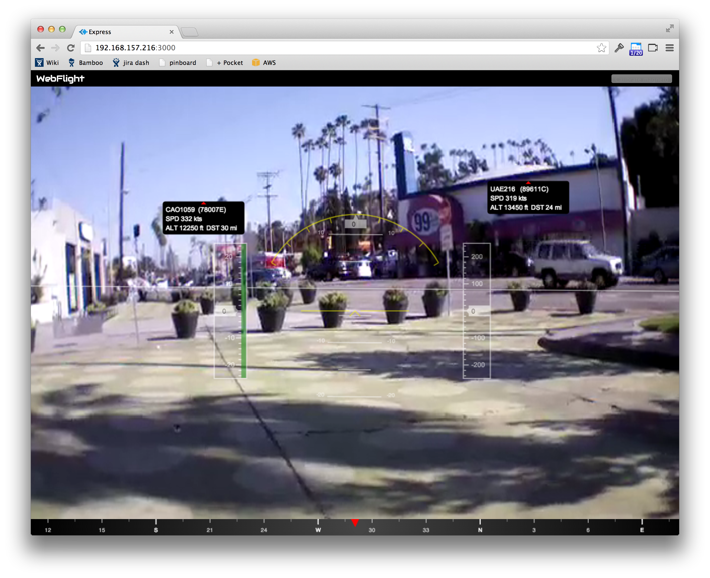

# webflight-traffic

This is a plugin for the browser-based AR.Drone ground control station
[webflight](http://eschnou.github.io/ardrone-webflight/) that displays
nearby aircraft overlaid on the drone's camera feed.




## How it works

To properly show traffic onscreen we need to know 3 things:

1. Where the drone is.
2. The drone's attitude.
3. Where the traffic is.


### Where the drone is

The AR.Drone doesn't come with GPS, so for now I fake it:

```
this.dronePosition = {
  lat: 34.090303,
  lon: -118.276223
};
```

It should be possible to use a USB GPS, wifi SSID geolocation or some
other scheme to get the drone's position.


### The drone's attitude

The AR.Drone has gyros, accelerometers and a magnetometer which gives
us its heading, pitch and roll so we can figure out where on the video
feed to put the markers.

We just need to make sure we enable the magnetometer values in the
drone's navdata telemetry:

```
function initDrone(client) {
  // From the SDK.
  var default_navdata_options = (
    navdata_option_mask(arDroneConstants.options.DEMO) |
    navdata_option_mask(arDroneConstants.options.VISION_DETECT));
  // Enable the magnetometer data.
  client.config('general:navdata_options',
                default_navdata_options |
                navdata_option_mask(arDroneConstants.options.MAGNETO));
}
```


### Where the traffic is

Some aircraft (lots in Europe and Australia, some in the U.S.)
broadcast their GPS coordinates and other info using a scheme called
[ADS-B](http://en.wikipedia.org/wiki/Automatic_dependent_surveillance-broadcast).
For $20 you can buy a USB digital TV dongle that can actually pick up
ADS-B broadcasts.  You now have a virtual radar that can pick up
aircraft from up to 100 miles away.

This plugin assumes there is an ADS-B decoder serving SBS-1 style
messages at `localhost:30003`. See below for information on running a
decoder.
